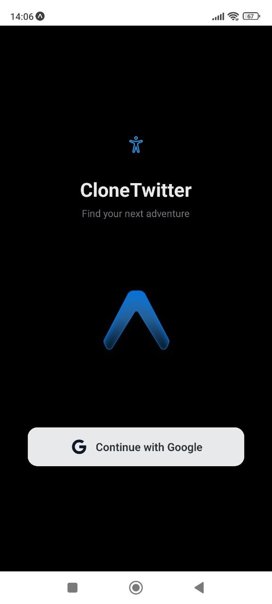
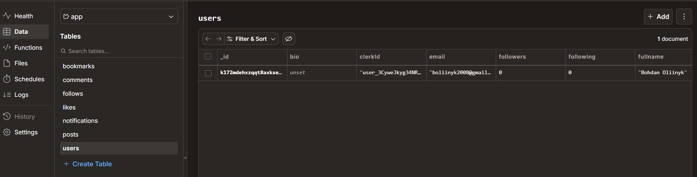

# CloneXTwitter

Мобільний додаток-клон соціальної мережі X (Twitter), створений з використанням Expo, Clerk та Convex.

## Учасники

| Ім'я   | Роль                                                          |
| ------ | ------------------------------------------------------------- |
| Богдан | Team Lead / Auth Developer / Backend Developer / UI Developer |

> Проєкт виконано індивідуально (всі ролі в одній особі)

## Технології

- **Expo** - фреймворк для React Native
- **Expo Router** - навігація (Stack + Tabs)
- **Clerk** - аутентифікація (Google OAuth)
- **Convex** - база даних та backend
- **TypeScript** - типізація

## Інструкція запуску

### Передумови

- Node.js (версія 18 або вище)
- npm
- Android Studio / Xcode (для емулятора) або фізичний пристрій з Expo Go

### Крок 1: Клонування репозиторію

```bash
git clone https://github.com/Bogdan228-228/CloneXTwitter.git
cd CloneXTwitter
```

### Крок 2: Встановлення залежностей

```bash
npm install
```

### Крок 3: Налаштування змінних середовища

- Створіть файл .env в корені проєкту:

```env
EXPO_PUBLIC_CLERK_PUBLISHABLE_KEY=...
EXPO_PUBLIC_CONVEX_URL=...
```

### Крок 4: Запуск додатку

```bash
npm start
npx convex dev
```

## Скріншоти

### Екран логіну



### Головний екран (Feed)


### Таблиці Convex, новий user


